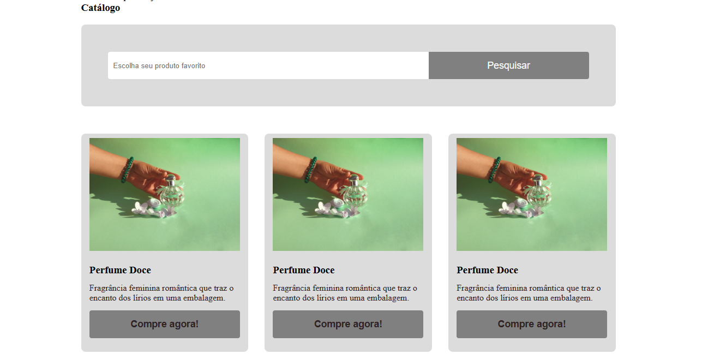

# Página de catálogo da empresa D&G 

## Sobre o Projeto:

Esse é um site da empresa D&G para demonstração de seu catálogo de perfumes.

## Aprendizado adquerido:

Objetivo de aprendizado nesse projeto é a utilização de grid e filtro de pesquisa.

## Projeto em construção 🚧 

## Instruçõs de uso:

Para que possa baixar esse projeto, será necessário:
* Fazer clone do projeto, no botão verde escrito <>Code.
* Selecionar a opção Download ZIP 
* Ter instalado na máquina um editor de código, no meu caso utilizo Visual Studio Code.

## Ferramentas utilizadas:

## Autora: 

  https://github.com/ThMenezes

